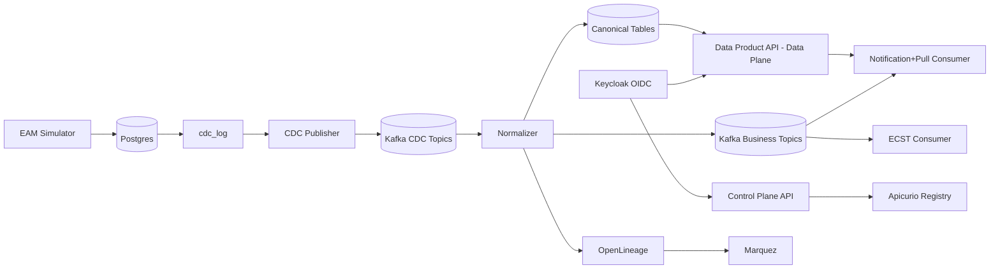
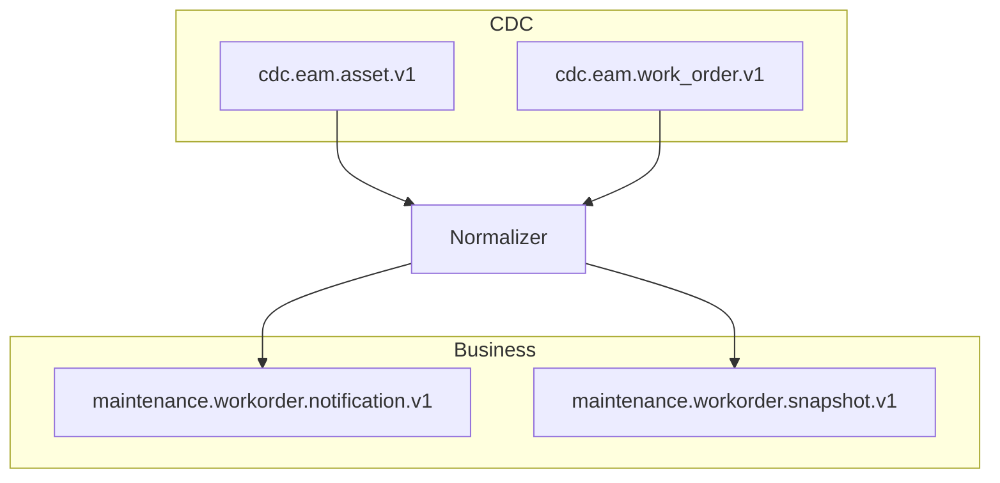

# datamesh-demo

## Overview

`datamesh-demo` is an Equipment Asset Management (EAM) Data Mesh proof-of-concept focused on two entities:

- `Asset`
- `WorkOrder`

The project demonstrates a contracts-first, event-driven data product that:

- Captures row-level CDC with `before` + `after` images
- Normalizes CDC into canonical business events
- Supports two consumer access patterns:
	- Notification + Pull
	- ECST Snapshot
- Exposes Data Plane and Control Plane APIs
- Registers contracts in Apicurio
- Emits lineage metadata for Marquez

## Docker permissions

The development environment uses Docker Compose directly. Ensure your user account has permissions to run Docker commands (typically by being added to the `docker` group).

### Codespaces Setup

When opening the repository in GitHub Codespaces, run the setup script to ensure the Docker Compose plugin is available:

```bash
.devcontainer/setup.sh
```

This script checks if the Docker Compose plugin is installed in `$HOME/.docker/cli-plugins/` and installs it if missing.

## Architecture

### High-level architecture description

The flow starts with the EAM simulator writing relational data to Postgres. Database triggers write changes to a CDC log. A CDC publisher sends row-level events to Kafka CDC topics. A normalizer consumes CDC, enriches and transforms events to canonical business topics, and writes canonical state back to Postgres. Consumers then either pull full state from the Data Plane or consume fat snapshots directly.

The Control Plane provides contract and interface discovery, while OpenLineage events are sent to Marquez for lineage visibility.

### Architecture diagram



### Tech stack

- **Runtime/Orchestration:** Docker Compose
- **Database:** PostgreSQL 16
- **Streaming/Event Bus:** Apache Kafka (KRaft)
- **Schema/Contract Registry:** Apicurio Registry
- **Lineage:** OpenLineage + Marquez
- **Identity/Auth:** Keycloak (OIDC)
- **Contracts:** JSON Schema, AsyncAPI, OpenAPI
- **Testing:** Pytest

### Topic/interface view



## Phase A

Phase A establishes platform foundations.

### Implemented

- Compose stack for core services in `platform/docker-compose.yml`
	- Postgres, Kafka, Apicurio, Marquez API/Web, Keycloak
	- Placeholder app services for EAM, CDC, Normalizer, Data Product, Consumers
- Bootstrap scripts:
	- `platform/bootstrap/00_create_topics.sh` (topic creation)
	- `platform/bootstrap/02_seed_keycloak.sh` (realm/client/user seed)
	- `platform/bootstrap/03_init_db.sql` (schema/triggers/canonical tables)
- Make targets wired in `Makefile`
- Smoke tests in `tests/smoke/test_phase_a_stack.py`

## Phase B

Phase B implements contracts-first artifacts.

### Implemented

- JSON Schemas in `contracts/schemas/`:
	- CDC Asset / WorkOrder
	- Canonical Asset Summary
	- Canonical WorkOrder Notification
	- Canonical WorkOrder Snapshot
- AsyncAPI specs in `contracts/asyncapi/`:
	- `asyncapi-cdc.yaml`
	- `asyncapi-business.yaml`
- OpenAPI specs in `contracts/openapi/`:
	- `openapi-data.yaml`
	- `openapi-control.yaml`
- Product contract in `contracts/contract/product.contract.yaml`
- Apicurio registration bootstrap update in `platform/bootstrap/01_register_artifacts.sh`
- Contract validation tests in `tests/contract_validation/`

## ToDo

Remaining phases to implement:

- **Phase C (EAM + CDC runtime):**
	- EAM Simulator API
	- CDC publisher service end-to-end behavior
	- Ensure exactly-once publication semantics from `cdc_log`
- **Phase D (Normalizer):**
	- CDC consumers/state store
	- Canonical transform + notification/snapshot emission
	- Canonical table upsert logic
	- OpenLineage event emission
- **Phase E (Data Product API):**
	- Data Plane endpoints implementation
	- Control Plane endpoints implementation
	- Keycloak auth middleware enforcement
- **Phase F (Consumers):**
	- Notification+Pull consumer
	- ECST consumer local read model
- **Phase G (Testing + Demo):**
	- Unit/integration/e2e completion
	- Deterministic demo script and validation
